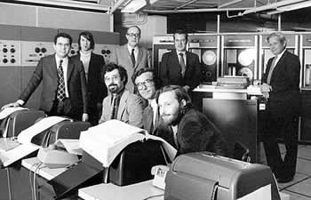
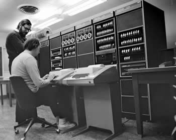
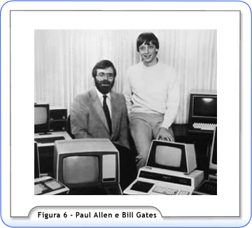
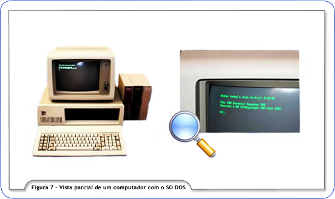
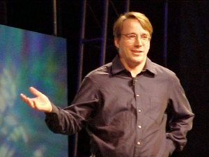
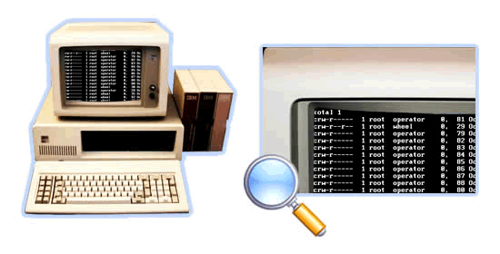

# Atividade: Pesquisa sobre a História e Evolução dos Sistemas Operacionais

## Objetivo

Compreender a evolução dos sistemas operacionais desde suas origens até os dias atuais, explorando os principais marcos históricos, inovações tecnológicas e o impacto dessas mudanças na computação e na sociedade.

## Descrição da Atividade

Pesquise sobre a história e a evolução dos sistemas operacionais, desde os primeiros sistemas até os mais modernos. Crie uma linha do tempo ilustrada que destaque os principais eventos, inovações e sistemas operacionais que marcaram cada período.

## Passos da Atividade

1. Pesquisa:

    - Pesquisar sobre os seguintes tópicos:
        - Primeiros sistemas operacionais (décadas de 1950 e 1960)
        - Sistemas operacionais da década de 1970
        - Evolução nos anos 1980
        - Avanços nos anos 1990
        - Sistemas operacionais no início dos anos 2000
        - Sistemas operacionais modernos (2010 em diante)

2. Conteúdo a ser Pesquisado:

    - Principais sistemas operacionais de cada década
    - Inovações tecnológicas introduzidas em cada período
    - Impacto dessas inovações na computação e na sociedade
    - Principais desenvolvedores e empresas envolvidas
    - Eventos históricos relevantes que influenciaram a evolução dos sistemas operacionais

3. Construção da Linha do Tempo:

    - Utilize ferramentas como Canva, Lucidchart, Prezi, ou software de sua preferência para criar a linha do tempo.
    - A linha do tempo deve conter:
        - Um eixo temporal com décadas marcadas
        - Eventos e marcos históricos destacados em cada década
        - Imagens e descrições dos principais sistemas operacionais de cada período
        - Inovações tecnológicas e seu impacto

4. Entrega:

Entregue a linha do tempo em formato digital (PDF, imagem ou apresentação).

**Critérios de Avaliação:**

    - Pesquisa Completa: Qualidade e precisão das informações pesquisadas.
    - Organização e Clareza: Estrutura e clareza da linha do tempo.
    - Ilustrações e Recursos Visuais: Uso de imagens e recursos visuais para enriquecer a linha do tempo.

**Dicas para a Pesquisa:**

    - Utilize fontes confiáveis como livros, artigos acadêmicos e websites especializados em história da computação.
    - Procure comparar diferentes fontes para obter uma visão mais ampla e precisa sobre a evolução dos sistemas operacionais.
    - Utilize recursos visuais como fotos, diagramas e gráficos para enriquecer sua linha do tempo.

---
---

## Pesquisa em si

1. parte horizontal
    - Primeiros sistemas operacionais (décadas de 1950 e 1960): \
        Na década de 60, os primeiros "sistemas operacionais" eram únicos, pois cada computador era vendido com um sistema operacional específico. Isto gerava grandes problemas, pois resultava em arquiteturas diferentes e de pessoal especializado que entendesse de cada sistema operacional. Após essa fase, iniciou-se a pesquisa de sistemas operacionais que automatizassem as tarefas, pois os sistemas eram monousuários e tinham cartões perfurados como entradas (eliminando, assim, o trabalho de pessoas que eram contratadas apenas para trocar os cartões perfurados). \
        Um dos primeiros sistemas operacionais que tiveram destaque, o CTSS, desenvolvido pelo Centro Computacional Instituto de Tecnologia Massachusetts (MIT). A versão do CTSS, disponibilizada para usuários, foi demonstrada no IBM 7090 no MIT em novembro de 1961 e começou a funcionar efetivamente em 1963, onde foi utilizada por pesquisadores de computadores dos Estados Unidos. \
         \
        Em 1953, surgiu o sistema operacional chamado Multics, que foi um projeto realizado em parceria com o Instituto de Tecnologia Massachusetts (MIT), pela General Eletric (GE) e pelos laboratórios Bell (Bell Labs) e American Telephone and Telegraph (AT&T). A intenção era de que o Multics tivesse características de tempo compartilhado (vários usuários compartilhando os recursos de um único computador), sendo assim o sistema mais arrojado da época. Em 1969, já existia uma versão do Multics rodando num computador GE645. \
        
        Ref=[Instituto Federal de Educação, Ciência e Tecnologia, Sul-rio-grandense. - 1.2 História dos Sistemas Operacionais](http://uab.ifsul.edu.br/tsiad/conteudo/modulo1/sop/ua/at2/03.html)
    - Sistemas operacionais da década de 1970. \
        Na década de 70, quando começaram a surgir os primeiros computadores pessoais, houve a necessidade de um sistema operacional de fácil operacionalização (já que, desde então, os sistemas operacionais não facilitavam a vida do usuário leigo) \
        O Unix é um sistema operacional criado no início dos anos 70, principalmente por Dennis Ritchie e Ken Thompson. Suas principais características técnicas são sua portabilidade, sua capacidade de multi-usuário e de multitarefa, eficiência, alta segurança e o bom desempenho em tarefas de rede.
        Ref=[Instituto Federal de Educação, Ciência e Tecnologia, Sul-rio-grandense. - 1.2 História dos Sistemas Operacionais](http://uab.ifsul.edu.br/tsiad/conteudo/modulo1/sop/ua/at2/03.html)[Sistemas operacionais: a família Unix](https://edu.gcfglobal.org/pt/conhecimentos-tecnologicos/sistemas-operacionais-a-familia-unix/1/)
    - Evolução nos anos 1980. \
        Entre 1977 e 1981, a AT&T, alterou o Unix, fazendo algumas mudanças particulares e lançou o System III. Em 1983, após mais uma série de modificações, foi lançado o conhecido Unix System IV. Até hoje esse sistema é usado no mercado, tornando-se o padrão internacional do Unix, comercializado por empresas como IBM, HP, Sun. \
         \
        Então, em 1980, William (Bill) Gates e seu colega de faculdade, Paul Allen, fundadores da Microsoft (Figura 6.), compraram o sistema QDOS ("Quick and Dirty Operating System") de Tim Paterson por 50.000 dólares, batizaram-no de DOS (Disk Operating System) e licenciaram o software à IBM (Figura 7). O DOS fez tanto sucesso que foi utilizado como base para a tão conhecida família Windows. \
        
         \
        Ref=[Instituto Federal de Educação, Ciência e Tecnologia, Sul-rio-grandense. - 1.2 História dos Sistemas Operacionais](http://uab.ifsul.edu.br/tsiad/conteudo/modulo1/sop/ua/at2/03.html)
    - Avanços nos anos 1990 \
        No começo dos anos 90, um estudante de computação finlandês publicou em uma lista de discussão da Internet, que estava desenvolvendo um núcleo de um sistema operacional e perguntou se alguém gostaria de auxiliá-lo nesta tarefa. Este estudante chamava-se Linus Torvalds e o primeiro passo em direção ao tão conhecido Linux foi dado naquele momento. \
        
         \
        No início dos anos 90, Linus Torvalds começou a escrever um sistema operacional que podia ser executado em um computador pessoal da época. Ao mesmo tempo, um outro projeto estava sendo desenvolvido com a intenção de criar um sistema operacional tipo Unix gratuito: o projetoGNU. Este projeto tinha muitas ferramentas prontas, mas faltava o núcleo do sistema. Era uma questão de tempo para que o núcleo Linux fosse distribuído juntamente com as ferramentas GNU, dando origem ao que hoje conhecemos comoGNU/Linux, ou simplesmente Linux, um sistema operacional livre da família Unix. \
        Ref=[Instituto Federal de Educação, Ciência e Tecnologia, Sul-rio-grandense. - 1.2 História dos Sistemas Operacionais](http://uab.ifsul.edu.br/tsiad/conteudo/modulo1/sop/ua/at2/03.html)[Sistemas operacionais: a família Unix](https://edu.gcfglobal.org/pt/conhecimentos-tecnologicos/sistemas-operacionais-a-familia-unix/1/)
